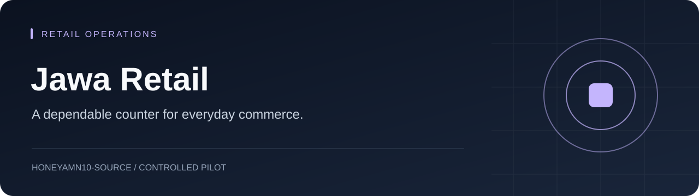
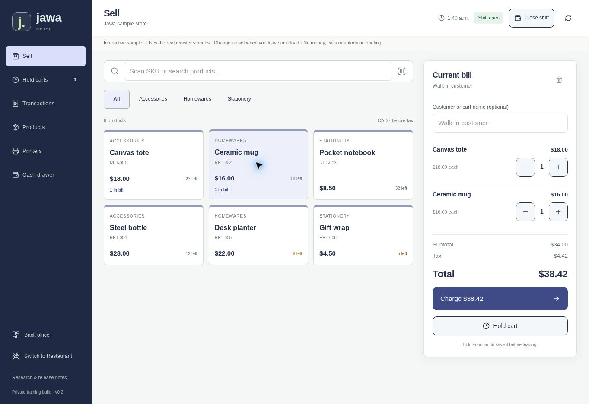

<p align="center"></p>

<h1 align="center">Jawa Retail</h1>
<p align="center"><strong>A dependable counter for everyday commerce.</strong></p>
<p align="center"><a href="#project-at-a-glance">Overview</a> · <a href="#start-here">Start here</a> · <a href="#project-guide">Project guide</a> · <a href="https://github.com/honeyamn10-source/pos-retail/issues">Issues</a></p>

[](https://github.com/honeyamn10-source/pos-retail/actions/workflows/server-kits.yml)

Self-hosted cash sales, returns, held carts and stock reporting.

## Project at a glance

| Current scope | Release boundary |
| --- | --- |
| **Controlled pilot** | Long-term history, payment adapters and physical hardware need validation. |



<sub>Preview from the repository; it does not certify untested integrations.</sub>

## Start here

Use the setup commands in the project guide below. Check configuration and current workflow results before deploying.

## Project guide

## 🚀 Quick start

Install **Node.js 24 LTS** and **pnpm 11.19.0**, then:

```sh
pnpm install --frozen-lockfile
pnpm run build:server
pnpm run start:server
```

Open [http://localhost:8787](http://localhost:8787). Use `data/setup-token` to create your owner account — no default password or ChatGPT login is required. Data persists on your server.

## ✨ Features

- 💵 **Cash sales & returns** with a SQLite transaction journal committed atomically with stock movements
- 🛒 **Held carts** for pending purchases
- 📦 **Inventory** with automatic stock updates
- 👥 **Staff action permissions** with per-role controls
- 🔍 **Owner-only searchable order history** (new in 0.5)
- 📊 **Custom business-date CSV reports**
- 💾 **Encrypted backup & recovery** including the journal
- 🖥️ **Desktop launchers** for prebuilt kits

The restaurant register remains available on `/restaurant`; this repository defaults to `/retail`. Both use the same transaction engine. For a shared store use one server installation, not two independent databases.

## 📖 Getting started

| Guide | Covers |
| --- | --- |
| [Deployment handbook](docs/CUSTOMER_DEPLOYMENT.md) | Customer deployment and integration |
| [Quick setup](docs/EASY_SETUP.md) | Fast local setup |
| [Server installation](docs/SERVER_INSTALL.md) | Installation, domain setup and recovery |
| [Server validation](docs/SERVER_VALIDATION.md) | Executed validation record |
| [Commercial launch checklist](docs/COMMERCIAL_LAUNCH_CHECKLIST.md) | Release readiness and open gates |

## 📁 Repository layout

```
pos-retail/
├── app/                 # Next.js application routes
├── components/          # UI components
├── server/              # Server / API logic
├── db/ + drizzle/       # Database schema and migrations
├── docs/                # Deployment, validation and research docs
├── deploy/              # Deployment configuration
├── public/              # Static assets
├── scripts/             # Build & operational helpers
├── tests/               # Test suite
├── START_JAWA.*         # Desktop launcher scripts
└── README.md            # Project guide
```

## 🛡️ Security

- Owner account created via a secure setup token — no default passwords
- Sessions and staff permissions enforced server-side
- No secrets, merchant database, `node_modules`, or private hosting identifiers in this repository
- Large OCR assets are reproduced during build from locked packages
- See [SECURITY.md](SECURITY.md) for the vulnerability policy

## 🤝 Contributing

Read [CONTRIBUTING.md](CONTRIBUTING.md) and the [Code of Conduct](CODE_OF_CONDUCT.md) before opening a pull request. Third-party components carry their own licenses — see [docs/THIRD_PARTY_NOTICES.md](docs/THIRD_PARTY_NOTICES.md).

## 📄 License

[MIT](LICENSE) © 2026 [Bittu Sharma](https://github.com/honeyamn10-source). Third-party assets and components retain their original licenses and notices.
