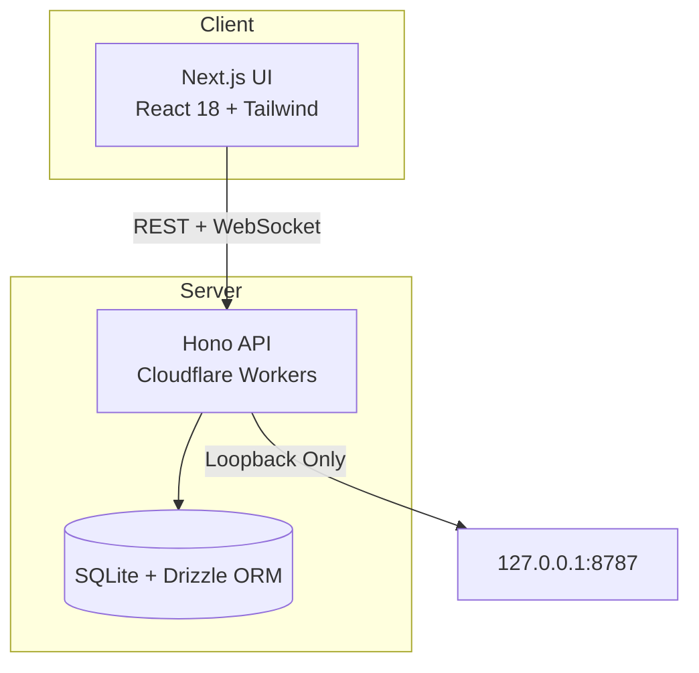

<!-- pos-retail | Bittu Sharma | ultra-level professional README -->
<p align="center">
  <strong style="font-size:3rem;color:#0EA5E9;">pos-retail</strong>
</p>
<p align="center">
  <em style="font-size:1.2rem;color:#94A3B8;">Self-hosted retail register — cash sales, held carts, inventory, back-office reporting</em>
</p>
<p align="center">
  
  
  
  
  
  
  
  
</p>

---

## Why this exists

Portfolio POS systems usually contain code but nothing you can click. This one is a
living demonstration: a **self-hosted retail register** that runs on your own
server — no cloud subscription, no forced login, no merchant database on a
third-party server. Sales, held carts, inventory, and backups persist on a
server you control.

> **Status: installable controlled pilot, not a completed commercial POS.**
> Cash sales/returns, held carts, inventory, and back-office reporting work in
> the tested scenarios. Live card payments and physical printer acceptance
> remain unfinished or unverified. The current bounded store supports at most
> 1,000 orders; long-term storage is a remaining release gate.

---

## Quick Start

```bash
# Install Node.js 20 LTS and pnpm 9+
pnpm install --frozen-lockfile
pnpm run build:server
pnpm run start:server
```

Open [http://localhost:8787](http://localhost:8787). Use `data/setup-token` to
create your owner account — no default password. Data persists on your server.

---

## Features

- 💵 **Cash sales & returns** with SQLite transaction journal committed atomically with stock movements
- 🛒 **Held carts** for pending purchases
- 📦 **Inventory** with automatic stock updates
- 👥 **Staff action permissions** with per-role controls
- 🔍 **Owner-only searchable order history**
- 📊 **Custom business-date CSV reports**
- 💾 **Encrypted backup & recovery** including the journal
- 🖥️ **Desktop launchers** for prebuilt kits

---

## Architecture



---

## Documentation

| Guide | Covers |
|-------|--------|
| [Deployment](docs/CUSTOMER_DEPLOYMENT.md) | Customer deployment and integration |
| [Quick Setup](docs/EASY_SETUP.md) | Fast local setup |
| [Server Install](docs/SERVER_INSTALL.md) | Installation, domain setup and recovery |
| [Validation](docs/SERVER_VALIDATION.md) | Executed validation record |
| [Launch Checklist](docs/COMMERCIAL_LAUNCH_CHECKLIST.md) | Release readiness and open gates |

---

## Security

- Owner account created via secure setup token — no default passwords
- Sessions and staff permissions enforced server-side
- No secrets, merchant database, `node_modules`, or private hosting identifiers
- Large OCR assets reproduced during build from locked packages

---

## License

MIT © 2026 Bittu Sharma
